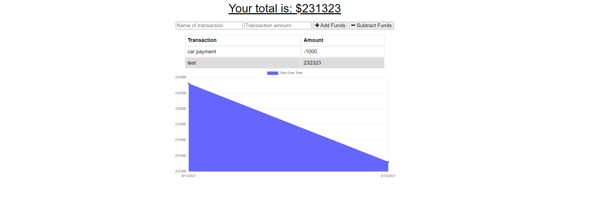

  # PWA Budget Tracker
  

  ## Description 
  This is a progress web app designed to help you track your budget and spending even when not connected to the internet. It makes use of service workers and mongodb to store and cache website info. 

  ## Table of Contents 
  - [Description](#description)
  - [Installation](#installation)
  - [Usage](#usage)
  - [License](#license)
  - [Contributing](#contributing)
  - [Tests](#tests)
  - [Questions](#questions)

  ## Installation
  Check out the deployment link below on heroku!

  ## Usage
  Use to keep track of your budget app will refresh with any inputs put while offline

  ## Deployment

  ## Screenshots 
  

  ## License
  

  ## Questions
  My github: aaronquach123
  My email: aaronquach12341@gmail.com
